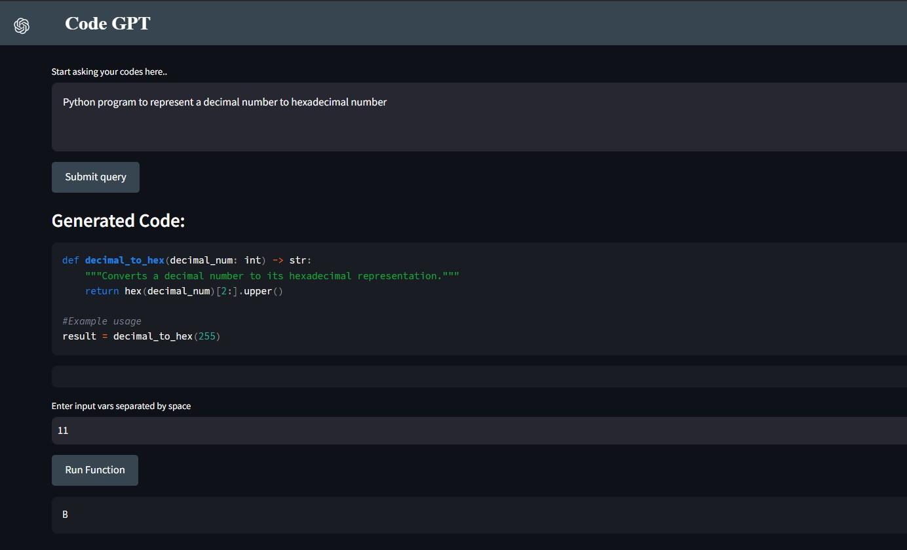

### 🚀 **Code GPT**: Generative AI Python Code Generator

A powerful AI-based solution that generates Python code based on user input prompts and allows you to execute it right in the UI.



### 🚀 Overview
Code GPT is a cutting-edge Generative AI tool that turns user prompts into functional Python programs instantly. What sets it apart? You can run the generated code right inside the app! Built on Langchain for smart prompt understanding, Mixtral from Groq for efficient AI computation, and powered by Python, this tool offers a smooth, all-in-one coding experience.


### 🌟 Unique Selling Point (USP)

Unlike other code generators, Code GPT lets you generate and run Python code directly in the UI—no need for external tools or manual copying.


### ✨ Features

* **AI-Powered Code Generation:** Create Python code from natural language prompts.
* **Integrated Execution:** Run the generated code inside the Streamlit app.
* **Function Extraction:** Automatically extract and run Python functions using subprocess.
* **User-Friendly Interface:** Intuitive, real-time interaction via Streamlit.


### 📂 Tech Stack

* **Mixtral from Groq:** Optimizes generative AI performance.
* **Streamlit:** Provides the interactive UI for code generation and execution.
* **Langchain:** Drives intelligent prompt-to-code conversion.
* **Python:** Core language for generation and execution.


### 🤖 How It Works

Code GPT extracts Python functions from generated scripts, accepts user inputs, and runs them safely using Python's subprocess module—all within the Streamlit UI, providing instant feedback.

### 💻 How to Run Locally

#### Prerequisites
Make sure you have the following installed:
- **Python 3.8+**
- **pip** (Python package installer)
- **Git** (to clone the repository)

### Steps to Pull and Run Code GPT
Follow these steps to clone the repository and run the app locally:

1. **Clone the repository**:
   Open your terminal or command prompt and run the following command to clone the repository to your local machine:
   
   ```bash
   git clone https://github.com/singh97kishan/CodeGPT.git

2. **Navigate to the project directory**
    Change into the project folder using:
    ```bash
    cd repository-name

3. **Create Virtual Env**:
    Create a virtual environment (optional but recommended): Set up a virtual environment to avoid conflicts with other Python packages. You can create one using:
    ```bash
    conda create -p venv -y

4. **Activate venv and install dependencies**:
    ```bash
    activate venv/
    pip install -r requirements.txt

5. **Run the Streamlit app**:
    ```bash
    streamlit run app.py

6. **Open the app in your browser:**
    After running the above command, Streamlit will provide you with a local URL (usually http://localhost:8501). Open it in your browser to start using Code GPT.

### 🛠️ How to Contribute
Contributions are welcome! If you'd like to help improve Code GPT, follow these steps:

1. Fork the repository.
2. Create a new branch for your feature:
    ```bash
    git checkout -b feature-name

3. Make your changes.
4. Commit and push your changes:
    ```bash
    git add .
    git commit -m "Added new feature"
    git push origin feature-name
5. Open a Pull Request on the original repository.

### 📝 License
This project is licensed under the MIT License.